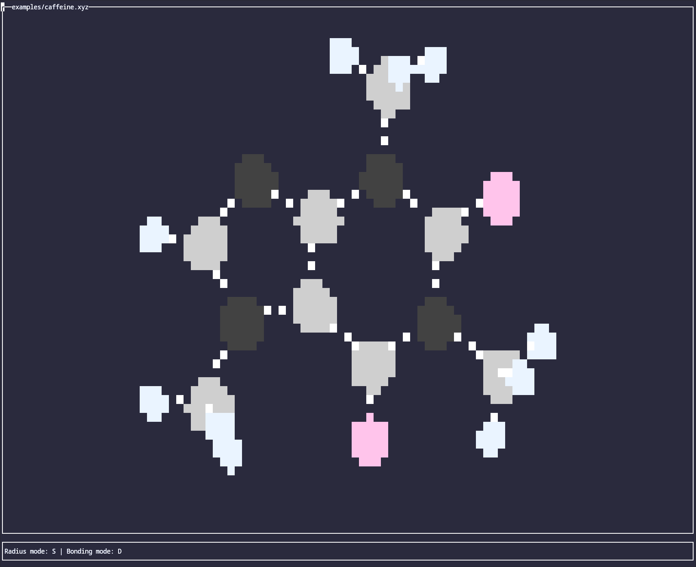
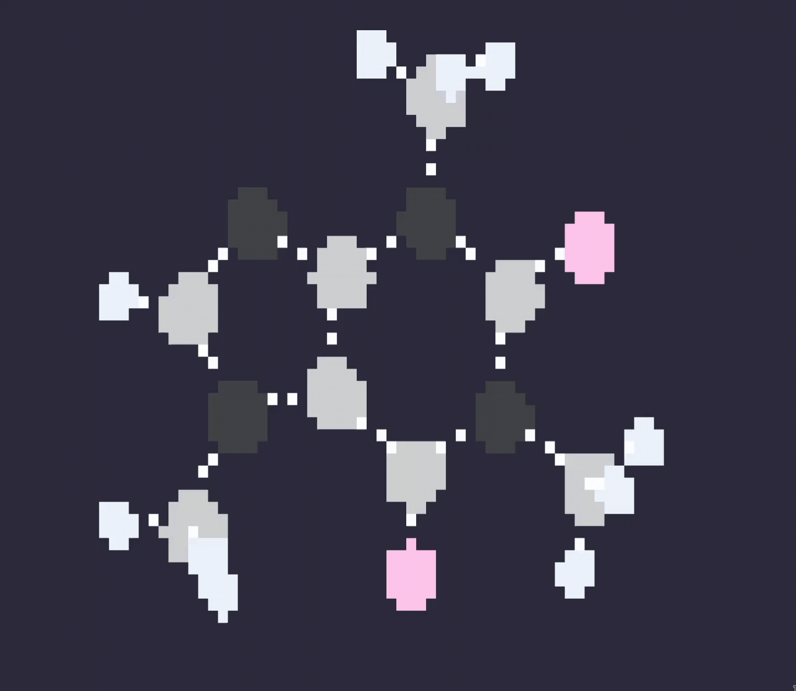
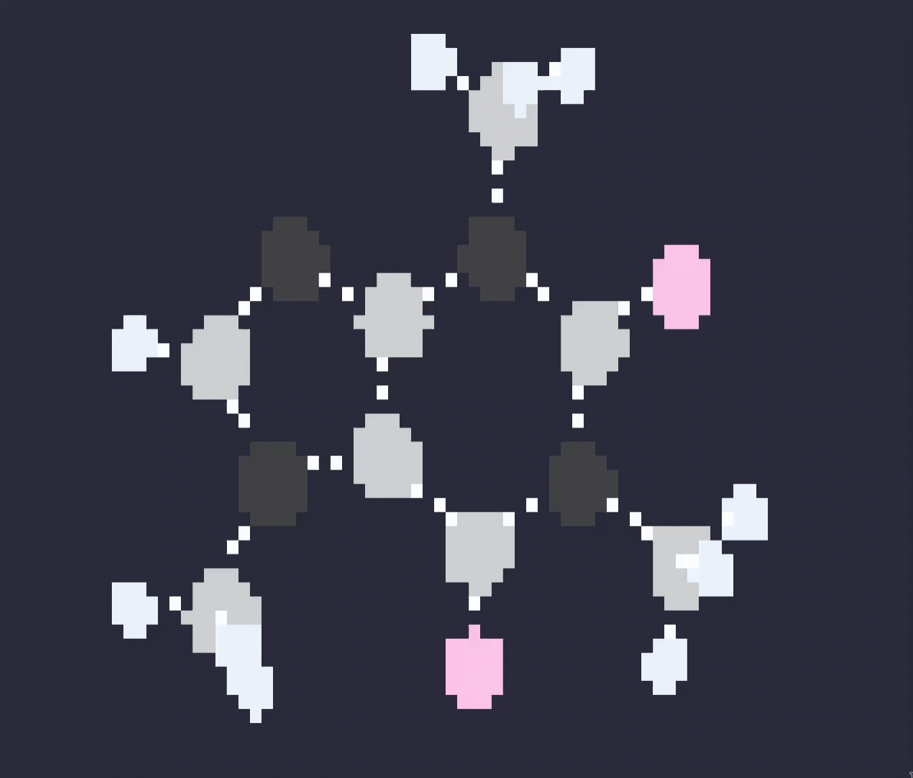
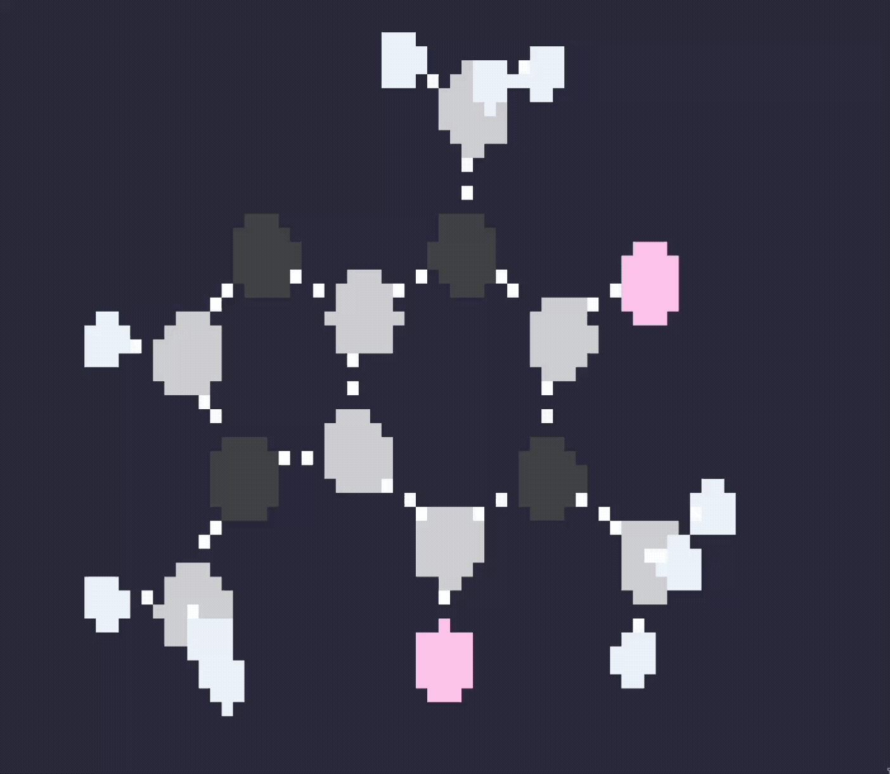

# catmol


**A molecule visualizer for the modern terminal.**

`catmol` renders molecular structures directly in your terminal, using block characters to represent atoms and bonds. It's a fast, lightweight, and script-friendly tool for quick molecular visualization without leaving the command line.


<p align=center> Caffeine molecule </p>


<p align=center> Caffeine molecule spinning </p>


<p align=center> Catmol different radius modes </p>


<p align=center> Catmol different bonding modes </p>

## Installation


### Prerequisites

Ensure you have a terminal that supports **xterm-256color** and a **Nerd Font** (or any font with good Unicode block character support) for the best visual experience.

### Method 1: Install from Source

1.  Ensure you have the build tools for C++ compilation and ncurses
2.  Clone the repository and build it:
    ```bash

    git clone https://github.com/d-haas/catmol.git

    cd catmol

    make
    ```
3.  Move the binary to your `PATH` (optional):
    ```bash

    sudo make install # Needs superuser permissions
    ```

### Method 2: Using a Package Manager

1. Simply execute the command to automatically install it from your disired package manager


```bash

# To be created

#yay -S catmol ## Not working yet

```

---

## Quick Start


Visualize a molecule from a file:


```bash

catmol molecule.xyz
catmol molecule*.xyz # This will get all molecules that fit the pattern
#(Ex: molecule0.xyz, molecule1.xyz, molecule_a.xyz, ...)

```


## Usage


```
catmol [FILES]

ARGUMENTS:
  [FILES]    The molecular structure file to visualize (XYZ only for now).

OPTIONS:
  -v, --version           Print version information
  -h, --help              Print this help message


```


## How It Works


`catmol` parses the molecular structure file to extract atomic coordinates and connectivity. It then projects the 3D coordinates onto a 2D plane (using a simple orthographic projection) and rasterizes the bonds and atoms into a grid of terminal cells. Each cell is then mapped to a colored character to create the final image.

Use the vi movement keys to navigate around:

* `h` and `l` rotate the molecule around the vertical axis;
* `j` and `k` rotate it around the horizontal axis;
* `H` and `L` go to the previous or next molecule if you opened more than one xyz file at once;
* `r` Alternates between the different radius modes (`Reduced`, `Simplified` and `Accurate`);
* `b` Alternates between the different bonding modes (`Dotted` and `Fill`);
* `q` exits the interface;

---

## License


This project is licensed under the GNU General Public License v3.0 - see the [LICENSE](LICENSE) file for details.

---

## FAQ


**Q: The output is colorless in my terminal.**

**A:** Ensure your terminal emulator has support for **xterm-256color**.


**Q: Why is it called `catmol`?**

**A:** It's a play on the Unix `cat` command, as it's often used to "concatenate and print" molecular structures to the terminal.
